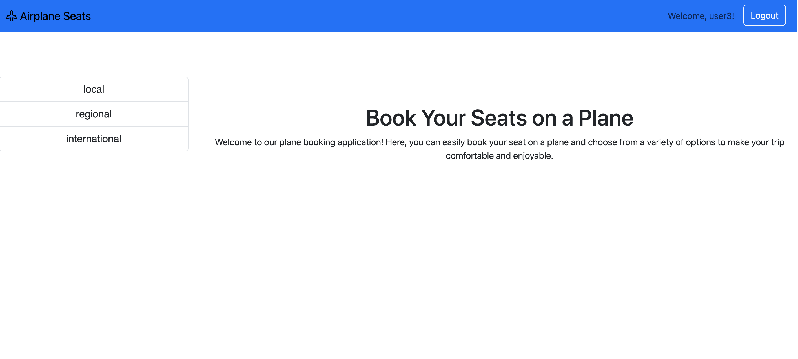
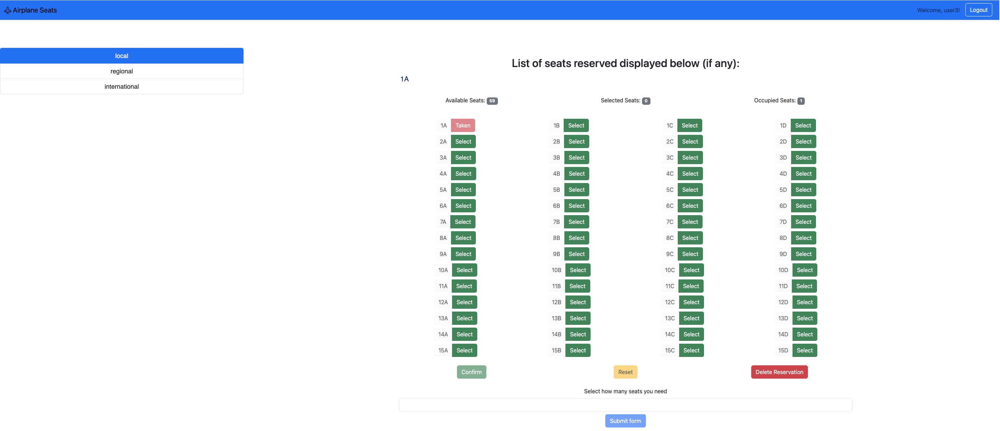

# AIRPLANE SEATS

## React Client Application Routes

- Route `/`: homepage of project
- Route `/plane/:planeId`: shows the seats of the specific airplane (`:airplaneId`) and gives the logged in user the possibility to reserve seats or cancel his reservation
- Route `/login`: login page, contains the login form for the authentication
- Route `*`: not found page 

## API Server


- POST `/api/sessions`
  - Performs user authentication by creating a new session.
  - Request body: username and user password
  - Reponse body: returns the info of the user but NOT password or salt

- DELETE `/api/sessions/current`
   - Performs user logout and delete the current user session.
   - Request body: None
   - Response body:  _None_

- GET `/api/sessions/current`
   - Gets information about the user, if he is logged in
   - Request body: None
   - Response body: return the id, email and name of the user

- GET `/api/planes`: gets all lines of planes table
  - Request body: None
  - Response: `200 OK` (success)
  - Response body: list of plane objects
    ```JSON
    {
      {
        "id": 1,
        "type": "local", 
        "nrows": 15
        "ncols": 4
      },
      {
        "id": 2,
        "type": "regional", 
        "nrows": 20
        "ncols": 5
      },
      {
        "id": 3,
        "type": "international", 
        "nrows": 25
        "ncols": 6
      },     
    }
    ```
    
  - Error responses: `500 Internal Server Error` (generic error)


- GET `/api/seats/:planeId`: retrieves all lines of seats table
  - Request body: None
  - Response: `200 OK` (success)
  - Response body: list of seats objects
     ```JSON
    {
      {
         "id": 1,
         "name": "1A",
         "occupied": 0,
      },
      {
         "id": 2,
         "pos": "1B",
         "occupied": 0,
      },
        ...  
    }
    ```
  - Error responses: `500 Internal Server Error` (generic error), `422 Unprocessable Content` (wrong planeId), `404 Not Found` (not present or unavailable)

- PUT `/api/seats/:planeId`: modify the states of the selected or assigned seats
  - Request body: list of requested seats Id
  - Response: `200 OK` (success)
  - Response body: list of seats that could not be reserved if there were no conflicts
  - Error responses: `422 Unprocessable Content` (wrong seats IDs), `400 Bad Request` (list elements were not integers), `503 Service Unavailable` (database error)


- GET `/api/reservation/:planeId`: gets a list of seats reserved in the specific plane by the user
  - Request body: None
  - Response: `200 OK` (success)
  - Response body: number of reserved seats
  - Error responses: `500 Internal Server Error` (generic error), `422 Unprocessable Content` (wrong planeId), `404 Not Found` (not present or unavailable)

- PUT `/api/deletereservation/:planeId`: modify the seats state of a specific plane by the user
  - Request body: null
  - Response: `200 OK` (success)
  - Response body: number of reserved seats
  - Error responses: `503 Service Unavailable` (database error), `422 Unprocessable Content` (wrong planeId), `404 Not Found` (not present or unavailable)

## Database Tables

- Table `planes` - contains all the airplanes (id, name, n_rows, n_clos)
- Table `seats` - contains all the seats of all the airplanes (id, name, plane_id, user_id, occupied)
- Table `users` - contains informations about the registered users (id, email, name, hash, salt, admin)

## Main React Components


- `SelectForm` in `SelectForm.jsx`: form below the seats grid. Allows to create a reservation specifing the number of seats to request (currently assigns randomly). 
- `Navigation` in `Navivation.jsx`: Navigation bar on top of page.Allows user log in.
- `SideBar` in `SideBar.jsx`: sidebar on the left containing the all planes. Clicking on one plane generates the corresponding seats map.
- `MainLayout` in `PageLayout.jsx`: layout to handle launch of the seats map. 
- `SeatsMap` in `SeatsMap.jsx`: main component of the project, manages the render of the seats grid, the buttons to manage reservations (both by manual selection and form), and the current state of the selected plane. 
- `DefaultLayout` in `PageLayout.jsx`: home page of the project. It gives a brief description of the website.
- `LoginForm` (in `Auth.jsx`): login form with possibility to insert username (email) and password. Alert to show errors (i.e. Incorrect username or password).


## Screenshot




## Users Credentials

- username: user1@polito.it, password:'password'
- username: user2@polito.it, password:'password'
- username: user3@polito.it, password:'password'
- username: user4@polito.it, password:'password'
